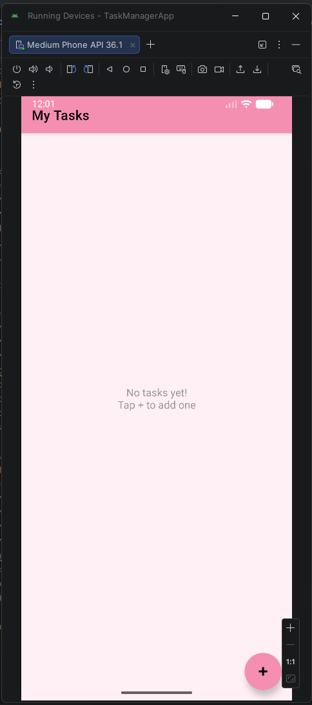
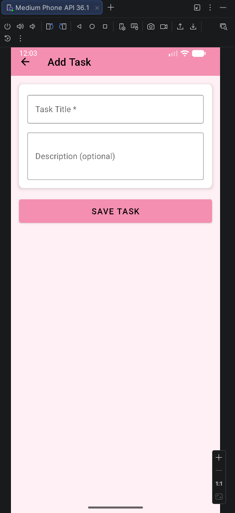
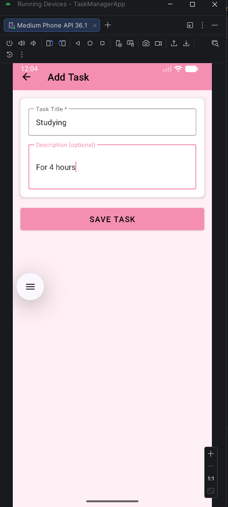
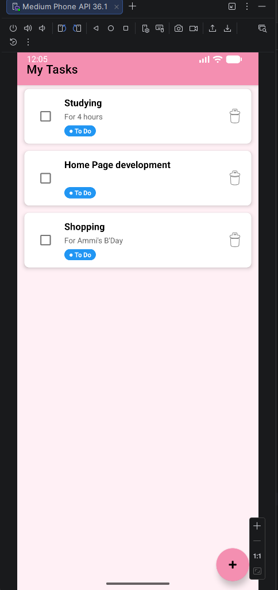
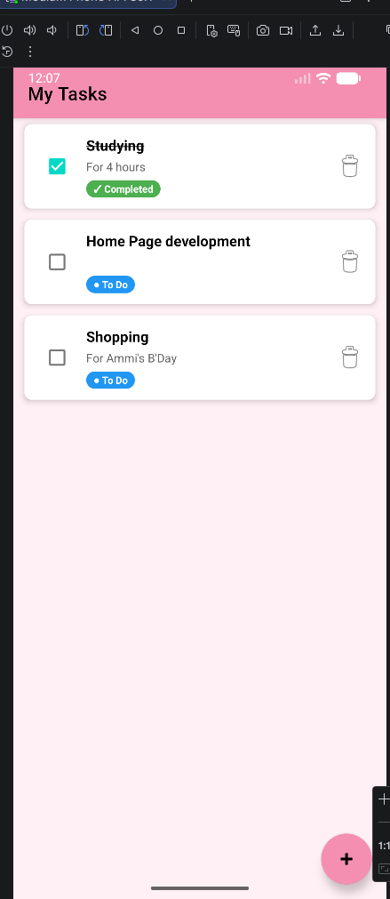
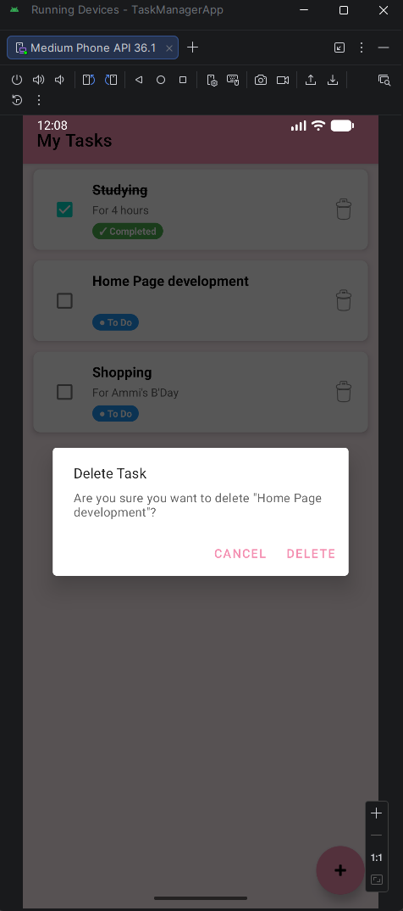
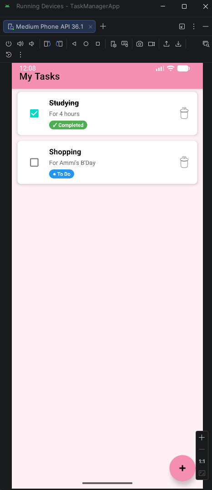

# Task Manager App
### SEN4302 - Mobile Application Development
### Assignment 03 – Mini Project

---

## App Description
Task Manager is a simple Android application that allows users to create, view, and manage their personal tasks/notes. Users can add tasks with a title and description, mark them as completed, and delete them. All data is stored locally on the device and persists even after the app is restarted.

---

## Features
- Add new tasks with a title and description
- View all tasks in a scrollable list
- Mark tasks as **Completed** or **To Do** using a checkbox
- Delete tasks with a confirmation dialog
- Data persists after app restart using SharedPreferences
- Handles screen rotation without losing data (ViewModel)
- Empty state message when no tasks exist

---

## Screenshots

| Front View | Add Task | Task Adding |
|---|---|---|
|  |  |  |

| To Do Tasks | Completed Tasks | Delete Task |
|---|---|---|
|  |  |  |

| After Deleting |
|---|
|  |

---

## Design Choices

### Architecture
The app follows a simple **MVVM (Model-View-ViewModel)** architecture pattern:
- **Model** – `Task.kt` defines the data structure
- **ViewModel** – `TaskViewModel.kt` manages all business logic and state
- **View** – `MainActivity.kt` and `AddEditTaskActivity.kt` handle UI only

### Data Persistence
**SharedPreferences** was chosen for data persistence because:
- The app stores simple task data that fits well in key-value storage
- No complex queries or relationships are needed
- It is lightweight and easy to implement
- Tasks are serialized to JSON using **Gson** library

### State Management
- `ViewModel` survives screen rotation — UI state is never lost
- `LiveData` automatically updates the UI when data changes
- `onSaveInstanceState` preserves unsaved text in the Add/Edit screen

### UI Design
- Follows **Material Design** guidelines
- Soft **pink pastel** color theme for a clean and friendly look
- `RecyclerView` with `CardView` items for a modern list appearance
- Status badges (**To Do** in blue, **Completed** in green) for quick visual feedback
- Floating Action Button (FAB) for easy task creation

---

## Secure Coding Practices

1. **MODE_PRIVATE Storage** – SharedPreferences is created with `Context.MODE_PRIVATE`,
   ensuring only this app can access the stored data.

2. **Input Validation** – User input is trimmed and validated before saving.
   Empty task titles are rejected with an error message.

3. **Safe Data Loading** – Data loading is wrapped in a try-catch block.
   If stored data is corrupted, the app safely returns an empty list instead of crashing.

4. **No Hard-Coded Sensitive Data** – No API keys, passwords, or sensitive
   information are stored anywhere in the codebase.

---

## Technical Details
- **Language:** Kotlin
- **Minimum SDK:** API 26 (Android 8.0)
- **Architecture:** MVVM
- **Data Persistence:** SharedPreferences + Gson
- **No internet permission required**
- **No backend or Firebase used**

---

## Project Structure
```
app/src/main/java/com/example/taskmanagerapp/
 ├── model/
 │    └── Task.kt                    # Data class for a task
 ├── data/
 │    └── TaskPreferencesHelper.kt   # SharedPreferences storage
 ├── viewmodel/
 │    └── TaskViewModel.kt           # State management & business logic
 ├── adapter/
 │    └── TaskAdapter.kt             # RecyclerView adapter
 ├── MainActivity.kt                 # Main screen (task list)
 └── AddEditTaskActivity.kt          # Add/Edit task screen
```

---

*Developed for SEN4302 Mobile Application Development*
